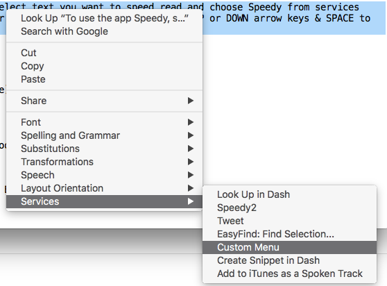

# services-menu
OSX - SysServices sample application

Sample mac application that register as a service provider and present a system level Services Menu "Custom Menu"

## Known Issues / My Observations

- Renaming the menu title does not reflect after building it for the first time, even after restarting!
- It is not listed under services in certain applications eg., chrome, safari. But works as expected in some apps eg., TextEdit

### Screenshot

### Resources

- [Apple - Services Implementation Guide](https://developer.apple.com/library/content/documentation/Cocoa/Conceptual/SysServices/Articles/providing.html#//apple_ref/doc/uid/20000853-SW1)
- [CREATING A SERVICE FOR MAC OS X
](http://simx.me/technonova/tips/creating_a_service_for_mac_os_x.html)

Special "Thanks" to David Sinclair - [@dejus](https://twitter.com/dejus) on [CoreInt Slack channel ](http://chat.coreint.org/) to confirm that I was on correct track.
